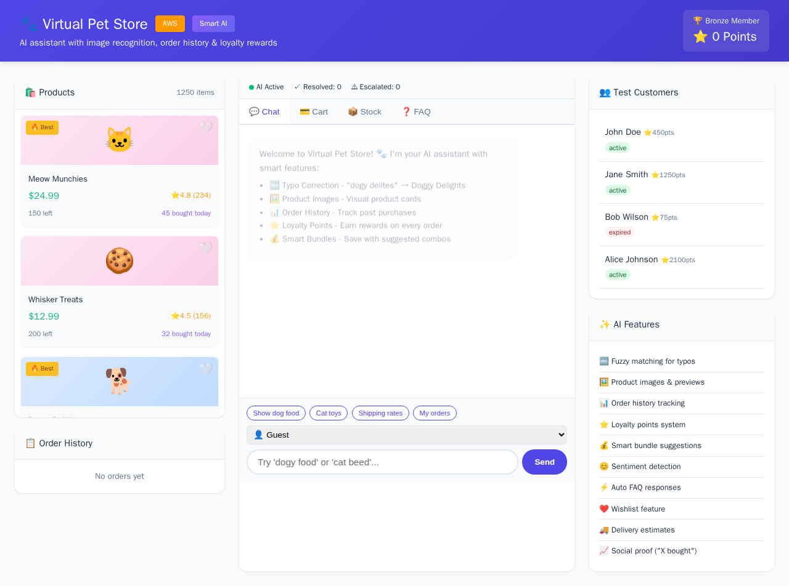
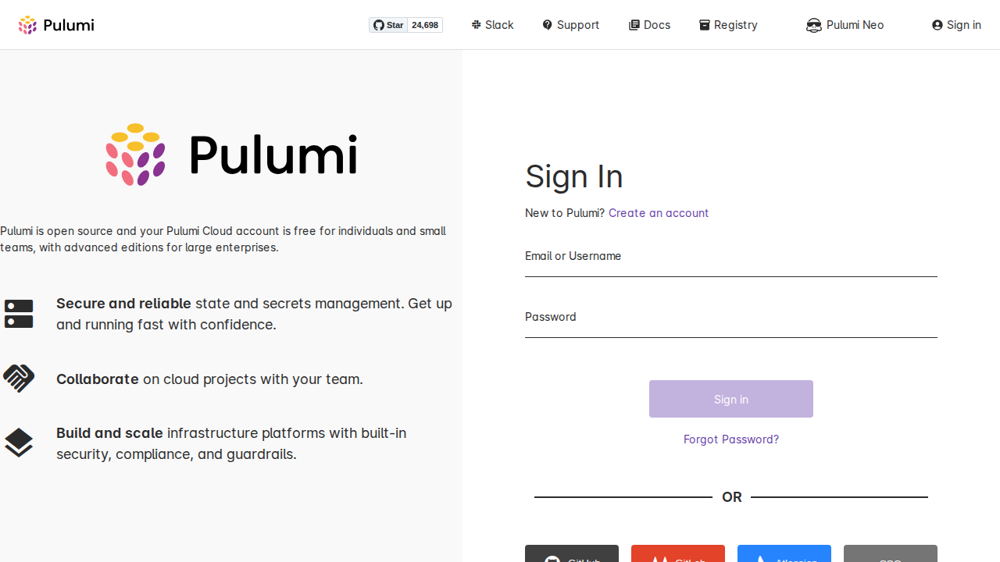

# AWS AI BUILDER HACKATHON LAB: CRAFT WITH AI AND BUILD WITH AI
## (Virtual Pet Store)

AI-powered infrastructure deployment using modern cloud-native tools.



---

## What Each Tool Does (Quick Reference)

| Tool | What It Did | Simple Use Case |
|------|-------------|-----------------|
| **Strands Agent** | AWS AI agent framework | Handles pet store customer queries using AWS Bedrock |
| **LangGraph Agent** | Graph-based AI workflows | Manages multi-step pet adoption process with state |
| **LlamaIndex Agent** | Data indexing & retrieval | Searches pet database and returns relevant matches |
| **Pulumi IaC** | Infrastructure as Code | Deploys all AWS resources with Python code |
| **Pulumi ESC** | Secrets management | Stores AWS keys and API tokens securely |
| **Pulumi Policy** | Compliance rules | Ensures all S3 buckets have required tags |
| **Pulumi Deployments** | Drift detection | Checks every 6 hours if infrastructure changed |
| **Amazon S3** | Object storage | Stores pet images and agent data files |
| **CloudFront** | CDN delivery | Serves website globally with low latency |
| **Secrets Manager** | Secret storage | Keeps Pulumi & LaunchDarkly API keys safe |
| **IAM** | Access control | Controls who can access what resources |
| **EC2** | Compute | Runs Coder workspace for development |
| **Arize Phoenix** | AI observability | Traces AI agent calls to debug issues |
| **LaunchDarkly** | Feature flags | Toggles features on/off without redeploying |

---

## Architecture Overview

```
┌─────────────────────────────────────────────────────────────────────────────┐
│                     AWS AI BUILDER HACKATHON PIPELINE                       │
├─────────────────────────────────────────────────────────────────────────────┤
│                                                                             │
│   ┌──────────────┐     ┌──────────────┐     ┌──────────────┐               │
│   │   STRANDS    │     │  LANGGRAPH   │     │  LLAMAINDEX  │               │
│   │    AGENT     │     │    AGENT     │     │    AGENT     │               │
│   │  (Queries)   │     │ (Workflows)  │     │  (Search)    │               │
│   └──────┬───────┘     └──────┬───────┘     └──────┬───────┘               │
│          │                    │                    │                        │
│          └────────────────────┼────────────────────┘                        │
│                               ▼                                             │
│                    ┌──────────────────┐                                     │
│                    │   PULUMI IaC     │  ← Deploys everything               │
│                    │  (Python SDK)    │    with code                        │
│                    └────────┬─────────┘                                     │
│                             │                                               │
│          ┌──────────────────┼──────────────────┐                            │
│          ▼                  ▼                  ▼                            │
│   ┌──────────────┐   ┌──────────────┐   ┌──────────────┐                   │
│   │  Pulumi ESC  │   │   Policy     │   │ Deployments  │                   │
│   │  (Secrets)   │   │   (Rules)    │   │  (Monitor)   │                   │
│   └──────────────┘   └──────────────┘   └──────────────┘                   │
│                             │                                               │
│                             ▼                                               │
│   ┌─────────────────────────────────────────────────────────────────────┐  │
│   │                         AWS SERVICES                                 │  │
│   │  ┌─────────┐  ┌─────────┐  ┌─────────┐  ┌─────────┐  ┌─────────┐   │  │
│   │  │   S3    │  │CloudFront│  │ Secrets │  │   IAM   │  │   EC2   │   │  │
│   │  │(Storage)│  │  (CDN)  │  │  (Keys) │  │ (Access)│  │(Compute)│   │  │
│   │  └─────────┘  └─────────┘  └─────────┘  └─────────┘  └─────────┘   │  │
│   └─────────────────────────────────────────────────────────────────────┘  │
│                             │                                               │
│                             ▼                                               │
│                    ┌──────────────────┐                                     │
│                    │  OBSERVABILITY   │                                     │
│                    │  Arize (Traces)  │  ← Debug AI calls                   │
│                    │  LaunchDarkly    │  ← Toggle features                  │
│                    └──────────────────┘                                     │
│                                                                             │
└─────────────────────────────────────────────────────────────────────────────┘
```

---

## Hosted Website

**Virtual Pet Store**: https://d15amxqcyx00y1.cloudfront.net/

---

## Pulumi Configuration

| Setting | Value |
|---------|-------|
| **Organization** | `Dhrumilshah77-org` |
| **Project** | `virtual-petstore` |
| **Strands Stack** | `strands-agent-dev` |
| **LangGraph Stack** | `langgraph-agent-dev` |
| **LlamaIndex Stack** | `llamaindex-agent-dev` |
| **ESC Environment** | `default/petstore-env` |
| **Policy Pack** | `petstore-policy` |

---

## Screenshots

### Virtual Pet Store Website


### Pulumi Stack Overview


---

## Quick Start

```bash
pip install pulumi pulumi-aws
pulumi stack select strands-agent-dev
pulumi up --yes
```

---

## Project Structure

```
├── __main__.py           # Main infrastructure code
├── Pulumi.yaml           # Project config
├── Pulumi.*.yaml         # Stack configs
├── policy-pack/          # Compliance policies
├── screenshots/          # Project images
└── docs/                 # Architecture diagrams
```

---

**Built at AWS AI Builder Hackathon | February 2026**
